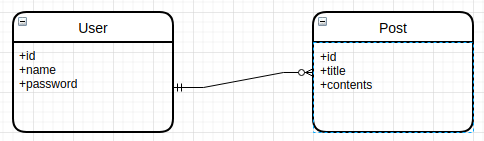
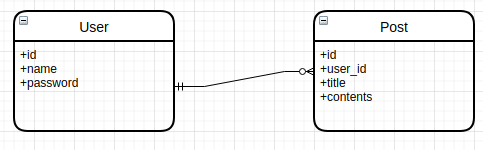

<br> 

> 학습목적으로 작성되어 생략된 내용과 다소 부적확한 내용이 있을 수 있습니다.

> 다루는 내용  
> @Entity, Jpa 연관관계, 편의메소드, @Embedded , @Embeddable

# 예제로 사용해볼 관계도



`User(유저)`테이블 과 `Post(게시물)` 테이블이 있습니다.
이때 `유저`는 여러개 의 `게시물`을 작성 할 수 있습니다.


위의 테이블 구조로는 `유저`가 작성한 `게시물`이 어떤것 인지 알수 없습니다.  
그래서 이때 relation id 를 둘중 하나의 테이블에 저장 해두어야 합니다.



한명의 `User` 가 여러개의 `Post` 를 가질 수 있으므로, `Post` 테이블에 관계 ID를 저장하도록 변경합니다.
`Post` 테이블에 `user_id` 컬럼은 `User` 테이블의 고유 `id`입니다.  

## 데이터

- User 테이블

|id|name|password|
|------|---|---|
|1|name1|pass1|
|2|name2|pass2|
|3|name3|pass3|

- Post 테이블

|id|user_id|title|contents|
|------|---|---|
|1|3|제목 123|내용|
|1|3|제목 748|내용|
|2|1|제목 189|내용|
|3|2|제목 1894|내용|
|3|2|제목 181|내용|

```sql

# user.id 가 "1" 인 post 찾기 쿼리  
select post from post where post.user_id = 1;

# post 테이블에서 "post.user_id = 1" 조건으로 user 데이터 가져오기
select user from post join user on post.user_id = user.id where post.user_id = 1;

# user 테이블에서 "user.id = 1" 조건으로 post 데이터 가져오기
select post from user join post on user.id = post.user_id where user.id =1; 

```

DB 에서는 한쪽 테이블에서 Relation Id(관계 ID)를 가지고 있어도 양방향 조회가 가능합니다.    


## 객체 관점에서 보기


```java

@Entity
@Table(name = "user")
public class User {

    @Id
    @GeneratedValue(strategy = GenerationType.IDENTITY)
    private Long id;

    @Column(name = "name", unique = true, length = 20, nullable = false)
    private String name;

    @Column(name = "password", length = 20, nullable = false)
    private String password;
    
    @OneToMany(mappedBy = "user")
    private List<Post> posts = new ArrayList<>();
    
    protected User() {
    }

    public User(String name, String password) {
        this.name = name;
        this.password = password;
    }

}

```

```java 


@Entity
@Table(name = "post")
public class Post {

    @Id
    @GeneratedValue(strategy = GenerationType.IDENTITY)
    private Long id;

    @Column(name = "title", length = 100, nullable = false)
    String title;

    @Lob
    @Column(name = "contents")
    private String contents;

    @ManyToOne(fetch = FetchType.LAZY)
    @JoinColumn(name = "user_id", foreignKey = @ForeignKey(name = "fk_post_user"))
    private User user;

    private Post() {
    }

    public Post( String title, String contents) {
        this.title = title;
        this.contents = contents;
    }
    
    public void toUser(User user) {
        this.user = user;
    }
}

```

앞서 DB 에서는 어느 한쪽에 연관 ID 를 가지고있으면 양방향으로 조회가되는것을 확인했었습니다.  
하지만 객체입장에서는 양방향이라는 것이 존재하지 않습니다.  단방향만 존재 할 뿐입니다.
여기서 단방향 관계란, 한쪽의 Entity 에서만 참조 되고있는 것을 말합니다.  
양방향 관계란, 양쪽 Entity 서로 참조 되고 있는 것을 말합니다.

위의 Entity 코드는 `User` -> `Post` , `Post` -> `User` 어느 Entity 에서든 서로 접근이 가능하기 때문에 양방향 참조 중입니다.

연관 관계 코드는 아래 두 부분입니다.

```java

** User entity
@OneToMany(mappedBy = "user")
private List<Post> posts = new ArrayList<>();


** Post entity
@ManyToOne(fetch = FetchType.LAZY) 
@JoinColumn(name = "user_id", foreignKey = @ForeignKey(name = "fk_post_user"))
private User user;

```

- `mappedBy` 옵션은 주인 테이블을 지정해주는 역할합니다. Post entity 에서 설정 되어있는 `user`를 지정합니다.
- `@JoinColumn` 으로 연관 관계 컬럼을 지정합니다. 연관 관계 컬럼은 `user_id`으로 설정합니다.

만약 `User entity` 에서 `@OneToMany`를 제거 한다면, `Post`->`User`의 단방향 관계로만 맵핑됩니다.  
보통은 처음에는 모두 단방향 관계로 설계했다가 프로젝트가 진행하면서 양방향으로 뚫어야 할때 그때 양방향으로 하는것을 지향한다고 합니다.
 
> [토크ON 41차. JPA 프로그래밍 기본기 다지기 T아카데미](https://www.youtube.com/playlist?list=PL9mhQYIlKEhfpMVndI23RwWTL9-VL-B7U)  
> 영상을 통해 자세한 기본 개념을 익히는데 도움이 됩니다.  

## DDL 문 확인하기

sql 출력 로그를 확인하기 위해 Spring 프로젝트의 `application.properties` 파일에 아래같이 설정합니다.  
H2 테스트 디비와 , sql 출력 설정입니다.
```text
spring.datasource.url=jdbc:h2:~/test;DB_CLOSE_DELAY=-1;DB_CLOSE_ON_EXIT=FALSE
spring.datasource.username=sa
spring.h2.console.enabled=true

spring.jpa.properties.hibernate.format_sql=true
spring.jpa.show-sql=true
logging.level.org.hibernate.type.descriptor.sql=trace
```

위 코드를 실행하고, DDL 문 출력 결과입니다.

```sql
create table post (
  id bigint generated by default as identity,
  contents clob,
  title varchar(100) not null,
  user_id bigint,
  primary key (id)
)

create table user (
  id bigint generated by default as identity,
  name varchar(20) not null,
  password varchar(20) not null,
  primary key (id)
)

# 유니크 설정 SQL 입니다.
alter table user 
  add constraint UK_gj2fy3dcix7ph7k8684gka40c unique (name)

# foregin key 설정입니다. 
# `@JoinColumn(name = "user_id", foreignKey = @ForeignKey(name = "fk_post_user"))` 설정 으로 발생하는 쿼리 입니다.
alter table post 
  add constraint fk_post_user 
  foreign key (user_id) 
  references user
```
> JPA 굳... 어노테이션 맵핑했을 뿐인데 DB 에 해당 부분에 맞추어 만들어줍니다!

### Entity Test 코드로 하나씩 짚어보기

#### 1. 양방향 맵핑시 무한루프 문제

양방향 맵핑시 무한루프가 문제가 발생 할 수 있습니다.  
코드 부터 보겠습니다. 

```java
@Test
void user_to_save_post() {
    // 1. new User
    User user = new User("name1", "PASSWORD!!");

    // 2. new Post
    Post post = new Post("제목", "내용입니다.");
    post.toUser(user);
      
    // 3. user.addPost()
    user.addPost(post);

    // 4. post.getUser()
    System.out.println(post.getUser()); // 무한 루프 발생 
}


# 콘솔 로그 
java.lang.StackOverflowError
	at com.example.jpaexamples.domain.User.toString(User.java:59)
	at java.base/java.lang.String.valueOf(String.java:2951)
	at com.example.jpaexamples.domain.Post.toString(Post.java:57)
	at java.base/java.lang.String.valueOf(String.java:2951)
	at java.base/java.lang.StringBuilder.append(StringBuilder.java:168)
	at java.base/java.util.AbstractCollection.toString(AbstractCollection.java:473)
	at java.base/java.lang.String.valueOf(String.java:2951)
```

`post.getUser()` 를 출력하려는데 `StackOverflowError`에러가 발생합니다.  
이유는 post -> user -> post -> user 계속해서 참조 객체를 찾으려 해서 문제가 발생 한것으로 보여집니다.  
이때에는 `toString()` 메소드를 수정해주어야 합니다.  

```java

# User
    @Override
    public String toString() {
        return "User{" +
            "id=" + id +
            ", name='" + name + '\'' +
            ", password='" + password + '\'' +
            ", posts='" + posts + '\'' +  =========================> 제거
            '}';
    }
    
# POST
    @Override
    public String toString() {
        return "Post{" +
            "id=" + id +
            ", title='" + title + '\'' +
            ", contents='" + contents + '\'' +
            ", user='" + user + '\'' +   ===========================> 제거
            '}';
    }

```

#### 2. 편의메소드 


```java 
@Test
void 편의메소드_예제() {
    // 1. new User
    User user = new User("name1", "PASSWORD!!");

    // 2. new Post
    Post post = new Post("제목", "내용입니다.");
    post.toUser(user);

    // 3. user.getPosts();
    System.out.println(user.getPosts());  ====> 결과 : []
}
```

`Post` 생성자를 통해 `user`참조 객체를 전달해주었습니다. `user.getPosts()` 출력은 [] 비어 있습니다.  
당연...하지만 편의메소드를 알아보기위한 예제입니다. ㅎ    
보시는것과 같이 객체는 단방향개념 밖에 없습니다. 그래서 객체입장에서는 양방향 관계라기 보다는 양방향 관계인것 처럼 만들어 주어야 합니다.

- 편의 메소드 리팩토링

```java 

@Entity
@Table(name = "post")
public class Post {
    ...
    
    public void toUser(User user) {
        user.addPost(this);
        this.user = user;
    }
    
    ...
```

`toUser` 메소드에 `user.addPost(this);` `user` 객체에도 자신(`post`)을 추가해주는 코드를 추가해줍니다. 이제 `post.toUser(user)` 메소드를 호출 하게 되면 `post` 객체에도 추가되고 `user` 객체에도 추가하도록 해주는게 `편의메소드`입니다.

수정 후 테스트 코드를 다시 실행 해보면 `user` 객체에도 추가된것을 확인 할 수 있습니다.

```shell
// 3. user.getPosts();
System.out.println(user.getPosts()); // [Post{id=null, title='제목', contents='내용입니다.'}]
```

### JpaRepository Test 

이제는 JpaRepository 테스트를 통해 데이터를 insert, select 테스트를 해보며 학습해보겠습니다.
간단하게 짚고만 넘어가겠습니다. `JpaRepository` 는 Entity 클래스를 CRUD 뿐만 `Query Methods`를 
사용하여 DB 쿼리를 만들어주어 추가,업데이트,삭제를 손쉽게 사용 할 수 있는 인터페이스입니다.
(다음에 자세하게 다루어 보겠습니다..)

[Spring Data JPA 문서](https://docs.spring.io/spring-data/jpa/docs/current/reference/html/#preface)


#### Entity 레포지토리 만들기

보통은 `{Entity Name}Repository` 의 형태로 이름을 정하고,   
`public interface {Entity Name}Repository extends JpaRepository<T, ID>` 의 형태로 레포지토리를 생성합니다.

```java
#  UserRepository
public interface UserRepository extends JpaRepository<User, Long> {
    Optional<User> findByName(String name);
}

# PostRepository
public interface PostRepository extends JpaRepository<Post, Long> {
    Optional<Post> findByTitle(String title);
}
```

#### JPA 테스트 하기

`@DataJpaTest` 를 사용하면 손쉽게 테스트를 진행 할 수 있습니다. 

``` java
@DataJpaTest
public class RepositoryTest {

    @Autowired
    UserRepository userRepository;

    @Autowired
    PostRepository postRepository;

}
```


- User 생성

```java
@Test
void user_save() {
    User user = new User("name1", "PASSWORD!!"); // (1) 비영속
    userRepository.save(user); // (2) 영속
}

# 출력 SQL
Hibernate: 
    insert 
    into
        user
        (id, name, password) 
    values
        (null, ?, ?)
        
binding parameter [1] as [VARCHAR] - [name1]
binding parameter [2] as [VARCHAR] - [PASSWORD!!]
```

(1) 은 비영속 상태로 `entityManage` 에게 매니징 되고 있는 아닌 상태입니다. (2) 에서 `save(entity)` 를 호출하게 되면 
DB에 `flush` 하게 되어 DB insert 가 보내지게 됩니다.  
여기서 말하는 `영속`, `비영속`은 엔티티 생명주기라고 하는데요.  
엔티티 생명주기에는
1. 비영속(new/transient): 영속성 컨텍스트와 전혀 관계가 없는 상태
2. 영속(managed): 영속성 컨텍스트에 저장된 상태
3. 준영속(detached): 영속성 컨텍스트에 저장되었다가 분리된 상태
4. 삭제(removed): 삭제된 상태

그럼 영속성 컨텍스트는 뭘까요... ㅜㅜ?  
우선은 업데이트 테스트 부터 보겠습니다.

```shell
@Test
void user_update() {
    User user = new User("name1", "PASSWORD!!");
    System.out.println("log (1)");
    User savedUser = userRepository.save(user);
    
    System.out.println("log (2)");
    savedUser.setName("이름 변경");
    
    System.out.println("log (3)");
    userRepository.flush();
}

# log 
log (1)
Hibernate: 
    insert 
    into
        user
        (id, name, password) 
    values
        (null, ?, ?)
log (2)
log (3)
Hibernate: 
    update
        user 
    set
        name=?,
        password=? 
    where
        id=?
```

log 찍힌걸 보면,   
`User savedUser = userRepository.save(user);` 으로 통해 `insert query` 가 commit 됩니다.  
이때 `savedUser` 는 영속성을 가지는 객체입니다.  
`savedUser.setName("이름 변경")` 반응없고,   
`userRepository.flush()` 에서 업데이트 쿼리가 commit 됩니다.    
`savedUser`는 엔티티매니져(영속컨텍스트)에 의해 관리 되고 있는 상태입니다.   
그래서 커밋 시점에 변경된 부분이 있으면 해당 부분을 DB 에 반영시키는 쿼리를 보냅니다.  

더 자세한 설명은...  
  
자세한 설명은 잘 정리된 블로그 링크로 대체하겠습니다. [링크](https://siyoon210.tistory.com/138)


##### Post save

Post 를 저장 해보겠습니다. 

```java 
    @Test
    void save_post() {
        User user = new User("name1", "PASSWORD!!");
        Post post = new Post("title", "content", user);
        postRepository.save(post);
    }
```

테스트를 실행하면 `org.hibernate.TransientPropertyValueException: Not-null property references a transient value ....` 에러가 발생합니다.

```java 
    @ManyToOne(fetch = FetchType.LAZY)
    @JoinColumn(name = "user_id", foreignKey = @ForeignKey(name = "fk_post_user"), nullable = false)
    private User user;
```

`@JoinColumn` 설정에서 `nullable = false` 옵션을 줬기 때문입니다. 그렇기 때문에 `Post` 저장시 `User` 는 영속(저장된) 상태여야합니다.

수정된 코드로 실행하면

```java 

    @Test
    void save_post() {
        User user = userRepository.save(new User("name1", "PASSWORD!!"));// User save
        Post post = new Post("title", "content", user);
        postRepository.save(post);
    }
    
    
    # 로그
    
Hibernate: 
    insert 
    into
        user
        (id, name, password) 
    values
        (null, ?, ?)
 : binding parameter [1] as [VARCHAR] - [name1]
 : binding parameter [2] as [VARCHAR] - [PASSWORD!!]
Hibernate: 
    insert 
    into
        post
        (id, contents, title, user_id) 
    values
        (null, ?, ?, ?)
 : binding parameter [1] as [CLOB] - [content]
 : binding parameter [2] as [VARCHAR] - [title]
 : binding parameter [3] as [BIGINT] - [1]
```

`user_id` 가 [1] 로 들어가지고 있는것을 확인 할 수 있습니다.

**이번에는** `User` 를 통해서 `Post`를 저장해 보겠습니다.

```java 
    @Test
    void save_user_post() {
        User user = new User("name1", "PASSWORD!!"); // User save
        Post post = new Post("title", "content");

        user.addPost(post);
        userRepository.save(user);
    }
    
    # 로그
    Hibernate: 
    insert 
    into
        user
        (id, name, password) 
    values
        (null, ?, ?)
```

하지만, `Post`는 저장되지 않습니다. 이유는 연관관계 주인이 아닌곳에서는(`mappedBy`) 읽기만 가능하기 때문입니다. 
이때 두가지 방법이 있습니다.  
`편의메소드`, `cascade 옵션`

**1. 편의 메소드**

```java
  # User 
  public void addPost(Post post) {
      post.toUser(this);
      this.posts.add(post);
  }
    
  # 테스트 코드 
  user.addPost(post);
  userRepository.save(user);
  postRepository.save(post);
```

`user.addPoat(post)` 호출시 내부에서 `post`에게도 양방향으로 적용해주는 방법입니다. 그리고 `post`를 save() 해주어야합니다.

**2. Cascade 옵션**

```java
    @OneToMany(mappedBy = "user", cascade = CascadeType.PERSIST)
    private List<Post> posts = new ArrayList<>();
```
`cascade = CascadeType.PERSIST` 옵션을 추가해주는 방법입니다. 

```java 
    @Test
    void save_user_post() {
        User user = new User("name1", "PASSWORD!!"); // User save
        Post post = new Post("title", "content");

        user.addPost(post);
        userRepository.save(user);
    }
    
    # 로그
    Hibernate: 
    insert 
    into
        user
        (id, name, password) 
    values
        (null, ?, ?)
        
    Hibernate: 
    insert 
    into
        post
        (id, contents, title, user_id) 
    values
        (null, ?, ?, ?)
```

`userRepository.save(user);` 할때, `id`가 NULL 이면 같이 저장을 수행합니다. 

>- CascadeType 의 종류
   - CascadeType.RESIST – 엔티티를 생성하고, 연관 엔티티를 추가하였을 때 persist() 를 수행하면 연관 엔티티도 함께 persist()가 수행된다.
   만약 연관 엔티티가 DB에 등록된 키값을 가지고 있다면 detached entity passed to persist Exception이 발생합니다.
   - CascadeType.MERGE – 트랜잭션이 종료되고 detach 상태에서 연관 엔티티를 추가하거나 변경된 이후에 부모 엔티티가 merge()를 수행하게 되면
   변경사항이 적용됨(연관 엔티티의 추가 및 수정 모두 반영됨)
   - CascadeType.REMOVE – 삭제 시 연관된 엔티티도 같이 삭제됨
   - CascadeType.DETACH – 부모 엔티티가 detach()를 수행하게 되면, 연관된 엔티티도 detach() 상태가 되어 변경사항이 반영되지 않음.
   - CascadeType.ALL – 모든 Cascade 적용


#### @Embedded , @Embeddable

좀더 객체지향적 개발을 위해 데이터를 상태와 행위를 가지는 객체로 추상화 시켜보겠습니다.  
이때에 `@Embedded , @Embeddable`를 활용할 수 있습니다.


```java 
@Embeddable
public class Posts {

    @OneToMany(mappedBy = "user", cascade = CascadeType.PERSIST)
    private List<Post> posts = new ArrayList<>();

    protected Posts() {

    }

    public void add(Post post, User writer) {
        post.toUser(writer);
        this.posts.add(post);
    }
}

```

```java 

@Entity
@Table(name = "user")
public class User {
    ...
      
    @Embedded
    private Posts posts = new Posts();
    
    public void addPost(Post post) {
        this.posts.add(post, this);
    }
    
    ...
```


`List<Post> posts` 일급컬렉션으로 `Posts`로 분리하였고 `@Embeddable`어노테이션을 붙였습니다.  
그리고,  사용되는 `Entity` 에서는  `@Embedded` 으로 활용하여 하나의 `Entity`인것 처럼 사용할 수 있습니다.


# 마무리

다루어야 될 많은 내용이 아직 많지만, 내용이 너무 길어지는것 같아 여기서 마무리 하겠습니다.
추후 내용 보완 및 추가해보겠습니다. 
감사합니다.