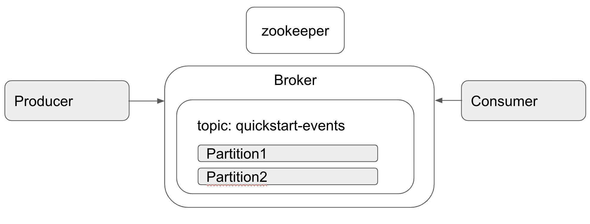

# 1.  카프로 빠르게 시작해보기
 - 카프카 [다운로드](https://www.apache.org/dyn/closer.cgi?path=/kafka/2.7.0/kafka_2.13-2.7.0.tgz)  
 - 압축해제  
<code>$ tar -xzf kafka_2.13-2.7.0.tgz</code>  
 - 주키퍼 실행   
<code>$ bin/zookeeper-server-start.sh config/zookeeper.properties</code>
 - 카프카 실행  
<code></code>$ bin/kafka-server-start.sh config/server.properties
 
 
 - 여기까지 하시면 기본적인 카프카 프로세스는 준비가 되었습니다.
 
- 토픽 생성하기  
<code>$ bin/kafka-topics.sh --create --topic quickstart-events --bootstrap-server localhost:9092</code>
- 생성된 토픽 확인하기  
<code>$ bin/kafka-topics.sh --describe --topic quickstart-events --bootstrap-server localhost:9092</code>
 ```
 생성된 토픽 리스트 
 Topic: quickstart-events	PartitionCount: 1	ReplicationFactor: 1	Configs: segment.bytes=1073741824  
	Topic: quickstart-events	Partition: 0	Leader: 0	Replicas: 0	Isr: 0
 ```

 - Producer 실행하고, 토픽내용 전송하기
```
$ bin/kafka-console-producer.sh --topic quickstart-events --bootstrap-server localhost:9092  
> first event send
> second event send  
```

- Consumer로 토픽 읽기
 ````
 $ bin/kafka-console-consumer.sh --topic quickstart-events --from-beginning --bootstrap-server localhost:9092  
 > first event send
 > second event send
   (토픽내용 받는것을 확인하였습니다)
 ````

| |
|:--:|
| *예제 구성도* |

여기까지 가장 기본적인 카프카로 토픽 생성하여 토픽전송과 토픽 받는 과정을 해보았습니다.  
해당 예제의 내용은 [카프카예제](https://kafka.apache.org/quickstart#quickstart_createtopic)에서 참고하여 작성되었습니다.  
[카프카 설명 동영상](https://www.youtube.com/watch?v=FKgi3n-FyNU&feature=emb_title) 해당 영상을 통해 카프카에 대해서 좀 더 쉽게 알 수 있습니다.


#### <참조링크>
[카프카 웹 사이트](https://kafka.apache.org/quickstart#quickstart_createtopic)


