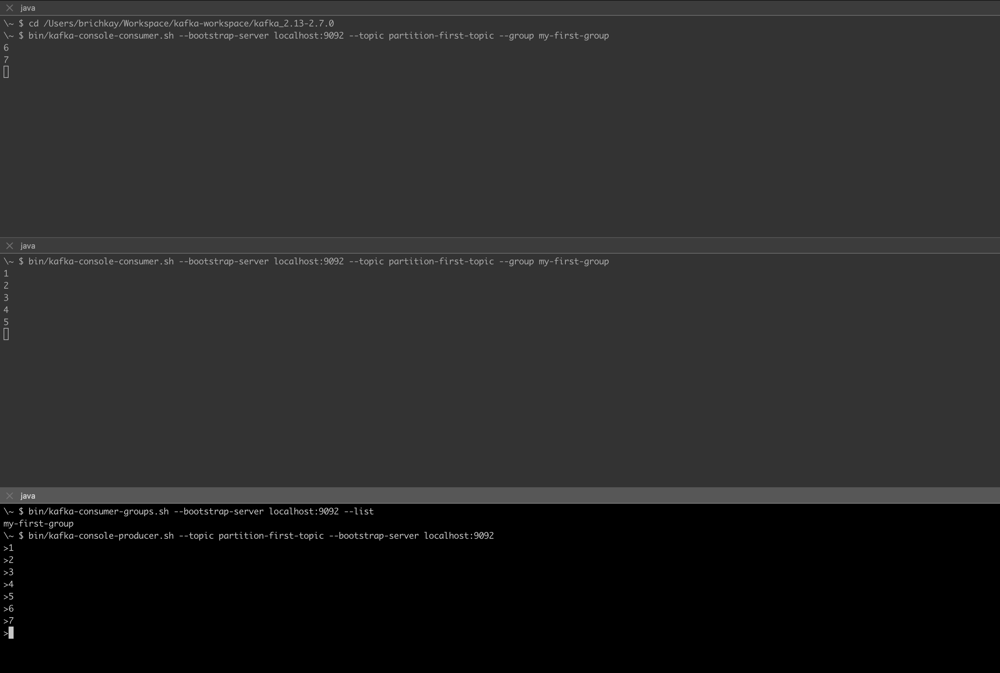
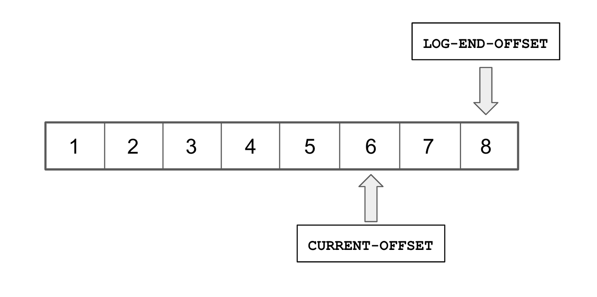

# 컨슈머 그룹?
지난번 카프카 파티션([링크](/kafka-partition/)) 에 대해서 알아 보았습니다.  
파티션을 만듬으로인해 Producer가 대량으로 토픽을 전송 하였을때,  
토픽을 저장 할 때 병목현상을 해결 할 수 있는 이점을 알 수있었습니다.  
그렇다면, 받는입장(Consumer)에서는 어떨까요?  

- 시나리오  
  - 이벤트 발생(Producer)이 10대의 서버에서 발생
  - Consumer 1대
  
위 와 같은 상황이라면, 이벤트를 처리하는(consumer) 속도보다   
이벤트를 쌓는(producer)가 더 많을 것으로 예상됩니다.  
그렇다면, 컨슈머 또한 늘려서 해소해야 될것같습니다.  
consumer group을 활용하여 이벤트를 분산 수행 하는것에 대해알아 보겠습니다.  

> 의문, 컨슈머를 여러대 만들면 되는거 아닌가?  
> 네, 만약 컨슈머 그룹이 아닌 컨슈머를 여러대 만든다면  
> 여려대의 컨슈머가 모두 같은 메세지를 받습니다.  
> 3개의 작업이 대기중일때
> 3대의 컨슈머가 있다면 3대 모두 3개의 작업을 진행 할 것입니다.(중복 작업)  
> 컨슈머 그룹을 활용 한다면 분산하여 작업을 진행 할 수 있습니다.  
> 컨슈머 그룹에 컨슈머 3대가 있다면 각각 1개 의 작업을 분산하여 진행 하는것을 기대하고 예제를 진행해보겠습니다.


```shell
# 주키퍼 실행
$ bin/zookeeper-server-start.sh config/zookeeper.properties

# 카프카 실행 
$ bin/kafka-server-start.sh config/server.properties

$ bin/kafka-topics.sh --zookeeper localhost:2181 --list
> __consumer_offsets
> partition-first-topic
> quickstart-events

# 컨슈머 그룹 실행 (기본적으로 컨슈머 실행 커맨드와 동입합니다. "--group my-first-group" 추가 합으로써 그룹이름을 지정해줍니다)
# 터미널 2개를 열어서 각 터미널에 동일하게 2번 실행하겠습니다.
# bin/kafka-console-producer.sh --topic partition-first-topic --bootstrap-server localhost:9092
# producer를 실행하여 빠르게 메시지를 보내시면 2개로 각각 분산되어 빠르게 토픽을 받는것을 확인 하실수 있습니다.
$ bin/kafka-console-consumer.sh --bootstrap-server localhost:9092 --topic partition-first-topic --group my-first-group
$ bin/kafka-console-consumer.sh --bootstrap-server localhost:9092 --topic partition-first-topic --group my-first-group
```


 - 컨슈머에 "my-first-group" 그룹을 지정하여 두개를 실행 하였고,  
   메시지가 나뉘어서 들어오는것을 확인 할 수 있습니다.  


```
# 컨슈머 그룹 리스트 확인하기
$ bin/kafka-consumer-groups.sh --bootstrap-server localhost:9092 --list
> my-first-group # 현재 1개의 컨슈머 그룹이 있는것을 확인할수있습니다.

# "my-first-group" 해당 컨슈머 그룹에 대한 정보 가져오기
$ bin/kafka-consumer-groups.sh --bootstrap-server localhost:9092 --describe --group my-first-group
GROUP           TOPIC                 PARTITION  CURRENT-OFFSET  LOG-END-OFFSET  LAG             CONSUMER-ID     HOST            CLIENT-ID
my-first-group  partition-first-topic 1          12              13              1               -               -               -
my-first-group  partition-first-topic 2          14              15              1               -               -               -
my-first-group  partition-first-topic 0          12              13              1               -               -               -

# 위의 정보에 대해서 알아보겠습니다.
# PARTITION: 파티션 번호
# CURRENT-OFFSET: 최근 가져온 offset 번호
# LOG-END-OFFSET: 현재 쌓여져 있는 마지막 offset 번호
# LAG: 아직 가져오지 못한 토픽 갯수
# 현재 파티션 3개에 각각 1개씩 LAG가 발생한것을  확인 하실 수 있습니다.
# 이는 3개의 토픽이 컨슈머가 가져오기 전이라는 뜻입니다.
```


|:--:|
| *위 그림은 6까지 가져왔고 마지막 메시지는 8이므로 LAG가 2개 발생 상태입니다.* |

| |
|:-------------------------------------------------:|
|          *출처 https://www.confluent.io/*           |


#### <참조링크>
[tutorial-getting-started-with-the-new-apache-kafka-0-9-consumer-client](https://www.confluent.io/blog/tutorial-getting-started-with-the-new-apache-kafka-0-9-consumer-client/)
