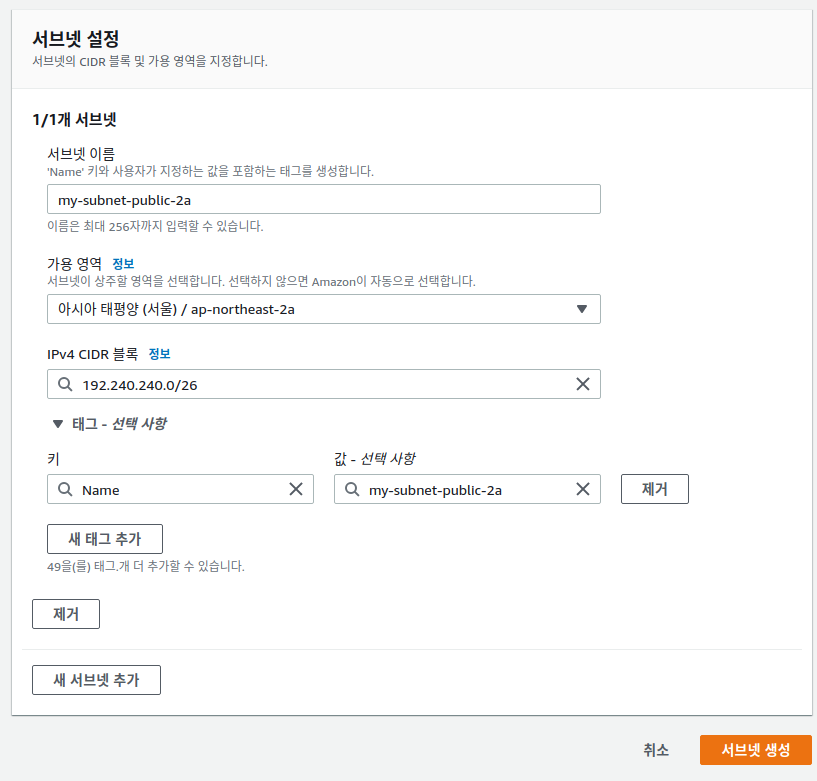
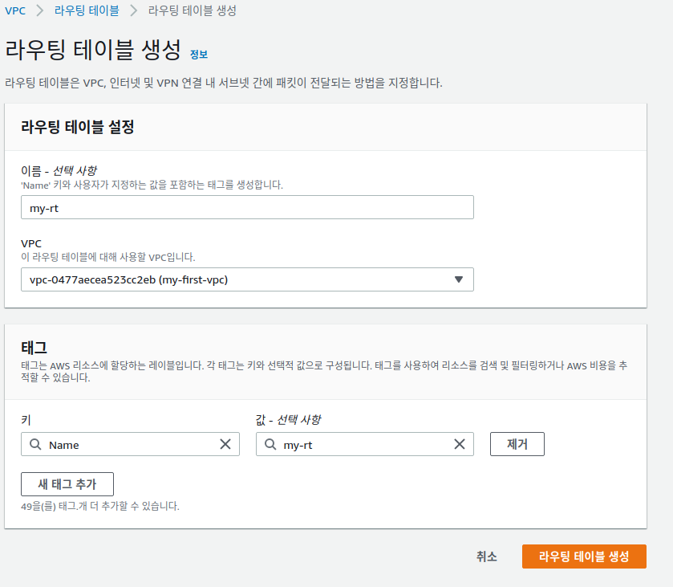
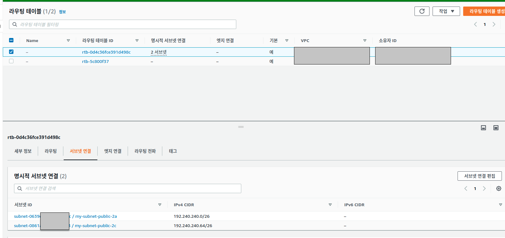
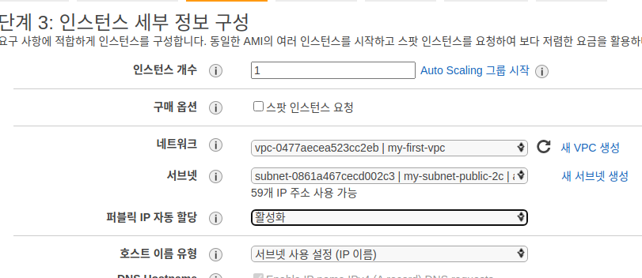

# "AWS 망분리"  
인프라 담당이 아니라면 깊이 있게 알기 힘들겠지만, 기본적으로 알아야 하는 부분이 있다고 생각합니다.  
"망분리"에 대해 알아 보겠습니다.

## 망분리??

망분리란 내부망과 외부망 등을 분리하여 외부의 침입을 막는거나 보안 이슈를 관리하기 위함입니다.  
예를 들면, 중요한 DB 혹은 사내전용 서버 등을 내부망(사내망)으로 분리하여 외부 노출을 분리합니다.
일반 고객이 접속해야하는 웹서비스 같은 경우 외부망을 오픈하여 외부 인터넷과 접속 할 수 있게 합니다.  
개인적인 실무 경험상(일반적인 웹개발자) 심리적으로 굉장히 안정이 됩니다. 인프라 혹은 보안 담당자 없이 AWS 구축하다 보면 무분별하게 생성되는 `PEM 파일`, 그리고 `인바운드 IP` 설정 등 시간이 지날 수록 서버 관리 영역이 관리가 힘들 정도로 난잡해 집니다.
그때 `private subnet` 과 `public subnet`을 분리해 보았는데 관리적인 측면에서 굉장한 이득을 볼 수 있었고, 작은 팀에서 AWS 로 서비스를 운용할때 보안의 불안함이 있는데 이부분에 대해 어느정도`심리적안정` 주는 경험했었습니다.

망분리에는 물리적 망분리와 논리적 망분리가 있습니다.  
이에 대한 설명은 링크로 대체하겠습니다. [링크](https://www.ahnlab.com/kr/site/securityinfo/secunews/secuNewsView.do?menu_dist=2&seq=14140)

## AWS 에서 망분리 할려면 어떻게?

우선 VPC 와 Subnet 에 대해서 간단하게 알고 가야 합니다.  
처음 접하시는 분이라면 개념정도로만 알고 가면됩니다.(저도 깊이있게 잘 알지는 모릅니다. 개념만 알고있는정도)

**[Amazon VPC란 무엇인가?](https://docs.aws.amazon.com/ko_kr/vpc/latest/userguide/what-is-amazon-vpc.html)**

> Amazon Virtual Private Cloud(Amazon VPC)를 이용하면 사용자가 정의한 가상 네트워크로 AWS 리소스를 시작할 수 있습니다. 이 가상 네트워크는 의 확장 가능한 인프라를 사용한다는 이점과 함께 고객의 자체 데이터 센터에서 운영하는 기존 네트워크와 매우 유사합니다  
> AWS Amazon VPC는 Amazon EC2의 네트워킹 계층입니다.

>다음은 VPC의 핵심 개념입니다.  
> - Virtual Private Cloud(VPC) — 사용자의 AWS 계정 전용 가상 네트워크입니다. 
> - 서브넷 — VPC의 IP 주소 범위입니다.  
> - 라우팅 테이블 — 네트워크 트래픽을 전달할 위치를 결정하는 데 사용하는 라우팅이라는 이름의 규칙 집합입니다.
> - 인터넷 게이트웨이 — VPC의 리소스와 인터넷 간의 통신을 활성화하기 위해 VPC에 연결하는 게이트웨이입니다.
> - VPC 엔드포인트 - 인터넷 게이트웨이, NAT 디바이스, VPN 연결 또는 AWS Direct Connect 연결을 필요로 하지 않고 PrivateLink 구동 지원 AWS 서비스 및 VPC 엔드포인트 서비스에 VPC를 비공개로 연결할 수 있습니다. VPC의 인스턴스는 서비스의 리소스와 통신하는 데 퍼블릭 IP 주소를 필요로 하지 않습니다. VPC와 기타 서비스 간의 트래픽은 Amazon 네트워크를 벗어나지 않습니다. 자세한 내용은 AWS PrivateLink 및 VPC 엔드포인트 단원을 참조하십시오.
> -  CIDR 블록 — 클래스 없는 도메인 간 라우팅입니다. 인터넷 프로토콜 주소 할당 및 라우팅 집계 방법입니다. 자세한 내용은 Wikipedia의 Classless Inter-Domain Routing을 참조하십시오.

우선 처음 접하시는 분이라면, VPC, Subnet,라우팅 테이블, 인터넷게이트웨이(igw) 만 알아도 좋습니다.  

- VPC
  - VPC 는 간단하게 하나의 서비스 네트워크 단위라고 생각하면됩니다.
- 서브넷 
  - 서브넷 은 VPC 를 좀 더 세부적인 대역폭으로 나누는 네트워크입니다.
- 라우트 테이블
  - 라우트 테이블은 다른 서브넷 혹은 외부 인터넷과의 통신 연결을 위한 정보를 가지고 있습니다.
- 인터넷 게이트 웨이
  - 인터넷 게이트 웨이는 외부 인터넷과 연결합니다. 인터넷게이트웨이를 통하지 않고서는 외부인터넷과 차단된 상태입니다.


[출처](https://docs.aws.amazon.com/ko_kr/vpc/latest/userguide/how-it-works.html)

AWS 서비스가 있고 리전 별로 VPC 가 나누어 집니다.   
VPC 안에서 `private subnet` 과 `public subnet` 이 분리 되어 있는것을 확인 할 수 있습니다.
subnet 안에 `ec2` 인스턴스 와 `RDS` 등 노드들이 존재합니다.  
그리고 이러한 서브넷관의 연결 혹은 인터넷과의 연결을 라우트 테이블에서 담당합니다.

리전은 다양하게 있습니다. 로그인 후 리전을 선택 하고 VPC 생성을 진행해보겠습니다.

```text
아시아 태평양 (홍콩) ap-east-1
아시아 태평양 (뭄바이) ap-south-1
아시아 태평양 (오사카) ap-northeast-3
아시아 태평양 (서울) ap-northeast-2
아시아 태평양 (싱가포르) ap-southeast-1
아시아 태평양 (시드니)ap-southeast-2
아시아 태평양 (도쿄) ap-northeast-1
```
AWS 로그인 후 `아시아 태평양 (서울) ap-northeast-2`으로 접속해서 VPC 를 만들어 보겠습니다.  
[aws vpc 페이지](https://ap-northeast-2.console.aws.amazon.com/vpc/home?region=ap-northeast-2#vpcs:)

### VPC 생성


이름 : my-first-vpc  
IPv4 CIDR : 192.168.240.0/24  

해당 정보말고 특별한 입력은 없습니다. 
여기서 `IPv4 CIDR : 192.168.240.0/24` 는 VPC 망에서 사용 할 IP 영역입니다.  

IP 대역은 [링크](https://cidr.xyz/)에서 확인 할 수 있습니다.  


저는 `192.168.240.0/24`로 하였는데,  
사용가능한 IP 갯수 :256  
사용가능 대역폭 : 192.168.240.1 ~ 192.168.240.254 

**CIDR** 네트워크 블록에 대해서는 위키백과 링크 참고해주세요~[위키백과](https://ko.wikipedia.org/wiki/%EC%82%AC%EC%9D%B4%EB%8D%94_(%EB%84%A4%ED%8A%B8%EC%9B%8C%ED%82%B9))

간략하게 보자면,  
..  
`/26` 64개 사용가능     
`/27` 32개 사용가능   
..  
`/24` 256개 사용가능  
..  

vpc 생성된 리스트 캡처  


### 서브넷(subnet) 생성
[서브넷 페이지](https://ap-northeast-2.console.aws.amazon.com/vpc/home?region=ap-northeast-2#subnets:)

**1. 생성한 VPC 를 선택합니다.**


**2. 서브넷 설정**

"가용 영역"이란것은 (AWS의 AZ(Availablity Zone)) 물리적으로 나뉘는 것이라고 보면됩니다. 같은 웹서비스라도 서로 다른 멀티 가용영역을 서브넷을 생성해서 운용하는게 추후 재해 재난시 한쪽 IDC 에 문제가 생겨도 다른 가용영역 서버로 구동 할 수 있기 때문입니다.  
"IPv4 CIDR" 블록 정보에 `192.240.240.0/26` 이라고 표기 하였는데요,  
이는 `192.240.240.1` ~ `192.240.240.62` 대역을 사용하겠다 입니다. 대역폭 확인은 위에서 말씀드린것처럼 [링크](https://cidr.xyz/) 여기서 확인하기 쉽습니다.  



서브넷을 한개 더 생성해보겠습니다. 


"CIDR 주소가 기존 서브넷과 중첩됩니다" 메시지가 나옵이다. 이는 다른 서브넷에서 해당 대역을 사용하고 있어서 중복이라는 말이므로,  
`192.240.240.64/26` 으로 변경해서 겹치지 않게 설정하여 생성해줍니다.  

### 라우팅 테이블 생성

라우팅 테이블을 생성 할 때에는 `VPC`를 지정해줍니다.  
생성 후 서브넷은 추가로 설정 해주어야 합니다.  



  
**라우팅 대상**


**서브넷연결하기**


`192.240.240.0/24` 대역폭 대상으로 활성화 되어 있고,  
해당 VPC 안에 있는 서브넷을 연결 시켜 주 었습니다.  


망 세팅은 여기까지 하고 `EC2`를 생성해서  통신에 대한 `Ping`테스트를 진행해보겠습니다.

--- 

### EC2 생성하기 
**1 OS 선택**


**2 VPC 및 서브넷 선택**
퍼블릭 IP 자동 할당은 `활성화`해주세요.



**3 인스턴스 유형**


**4 보안그룹은 ssh 접속용 22만 허용**


**5 pem key는 최초 한번만 발급되기때문에 보관 잘해야합니다.**


### EC2 SSH 접속하기 

`ssh -i "my-test.pem" ubuntu@{ ec2 ip }` 접속 


혹시 접속이 안된다면,
`chmod 400 { name.pem}` pem key 권한을 줍니다.  
그래도 안되면, 
`인바운드 IP` 에서 `22`번 포트를 `0.0.0.0`으로 설정하거나 `내 IP`로 해서 집 IP를 지정하셔야합니다.  
왠만하면 보안상 지정 IP 하나만 오픈해놓는게 좋습니다.  

외부랑 통신이 되는지 google 에게 ping 을 보내보겠습니다. 


사실 안됩니다. 왜냐하면 위에서 "라우트 테이블" 에서 인터넷 게이트 웨이를 연결 시켜주지 않았기 때문입니다.  
현재로써는 사용하고 있는 서브넷 망 모두 인터넷과 연결이 전혀 안된 상태인것이죠.  
이런 개념으로 별도의 `internal 라우트 테이블` 을 만들어서 "인터넷 게이트 웨이"를 연결 시키지 않고 내부망으로 사용 할 수 있습니다.  
"인터넷 게이트 웨이"가 연결 되어있다 하더라도, "인바운드 IP"를 허용하지 않는다면 외부->내부로 접속이 안되기도 합니다.   
현재는 내부->외부의 통신 테스트 입니다.  
"인터넷 게이트 웨이"를 연결 시켜보겠습니다.

### 라우트 테이블에 인터넷 게이트 웨이 연결


`0.0.0.0/0` 에 대해서 `igw(인터넷게이트웨이)` 를 추가 해주었습니다.  
이제 해당 서브넷을 가지고 있는 `ec2`인스턴스는 외부 인터넷으로 나갈 수 있는 상태입니다(내부 -> 외부 통신)


내부 -> 외부 인터넷 통신이 되는것을 확인 할 수 있습니다.


## 마무리

AWS VPC 와 서브넷을 생성해서 망분리를 해보고,  
라우트 테이블에 인터넷 게이트 웨이를 연결 시켜서 외부 통신이 되는지 알아 보았습니다.  
간략한 내용이지만 누군가에게 도움이 되었으면 좋겠네요~ 