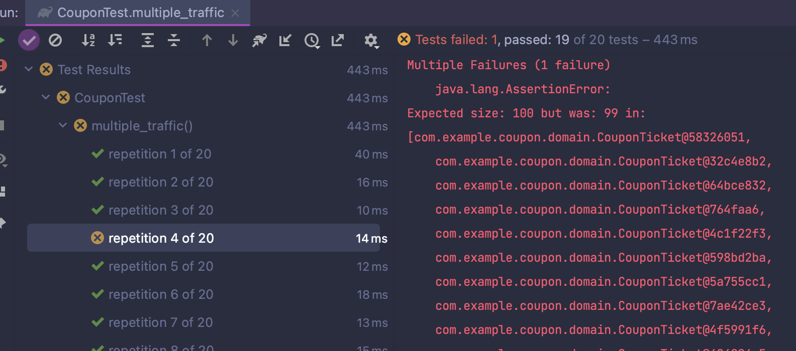
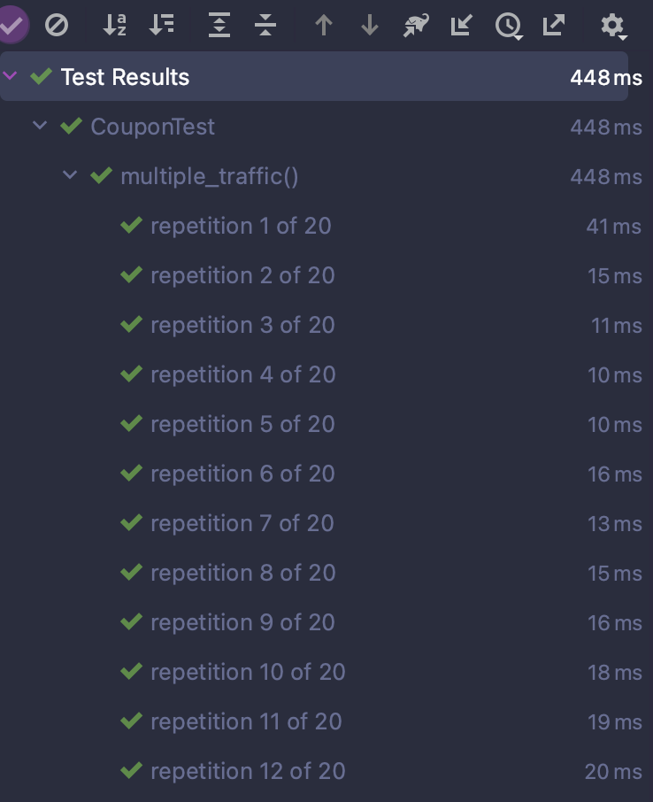
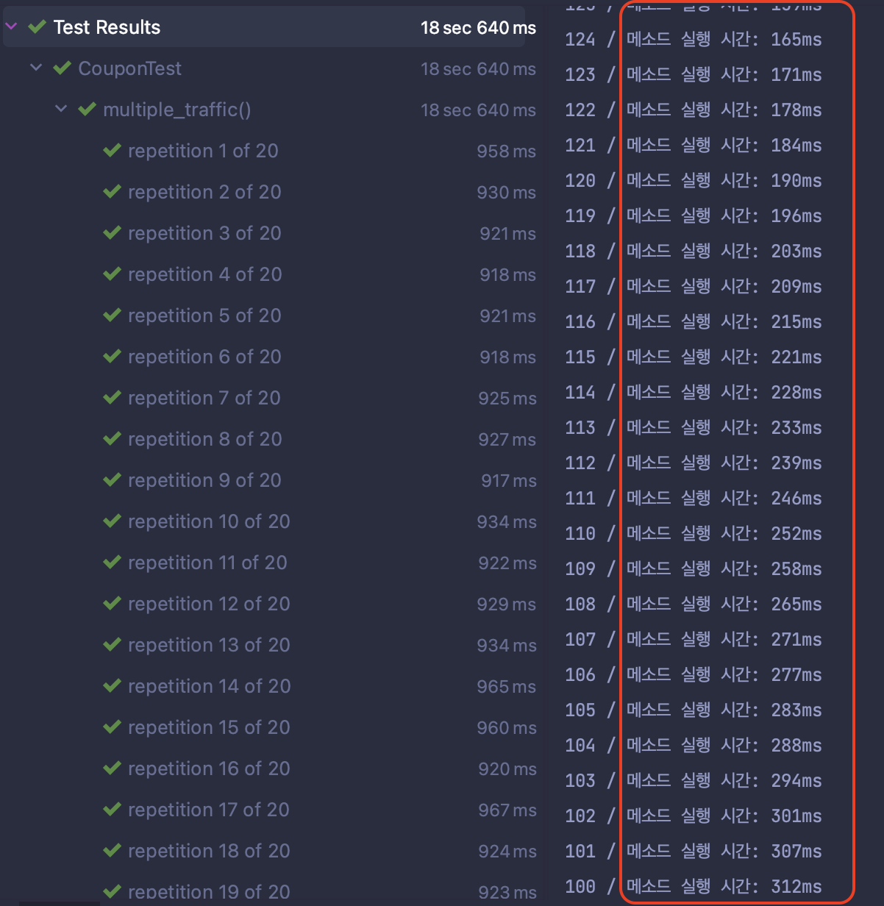
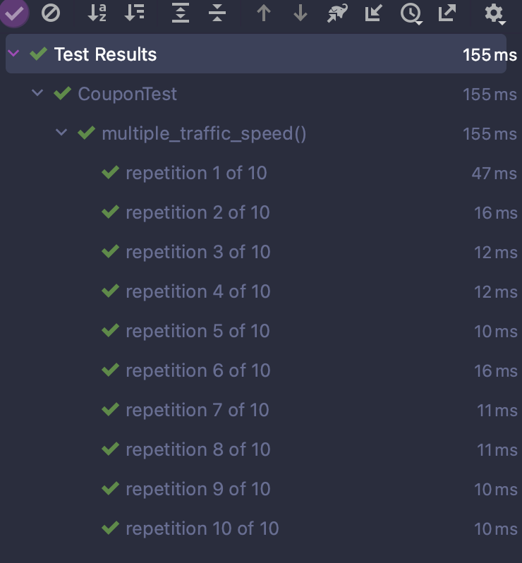

## 요구사항

> 팀장 : 다음주에 99% 할인 쿠폰 발행 행사를 하려고하는데, 다음주 까지 개발해주세요.  
> 요구사항은 다음과 같습니다.

1.  쿠폰은 최대 발행 갯수를 가지고 있습니다.
2.  쿠폰은 발행 갯수 만큼 발급 할 수 있습니다.
3.  쿠폰 발행 갯수 보다 쿠폰티켓을 초과 발급 할 수 없습니다.
4.  대규모 트래픽에서도 쿠폰 발행 갯수를 초과해서는 안된다.
5.  응답시간은 요청당 100ms이하로 한다.

### 정의

- 쿠폰
  - 최대 발행 갯수를 가진다.
  - 쿠폰티켓 발행된 갯수를 가진다.
  - 쿠폰티켓 발행 갯수는 최대 발행 갯수를 초과 할 수 없다.
- 쿠폰 티켓
  - 발행한 쿠폰이 존재한다.
  - 쿠폰 티켓을 소유한 유저ID 를 가지고 있다.

## 도메인

우선 도메인 부터 파악해보고자 한다.  
쿠폰은 쿠폰티켓을 발급 할 수 있다.  
쿠폰 티켓이 발급될때 발급 카운터를 증가시킨다.  

```java
#Coupon
public class Coupon {
    private final Long id;
    private final int publishLimit;
    private int published;

    public Coupon(Long id, int publishLimit, int published) {
        this.id = id;
        this.publishLimit = publishLimit;
        this.published = published;
    }

    public CouponTicket publish() {
        validRemain();

        published += 1;

        return CouponTicket.couponIdOf(id);
    }
    private void validRemain() {
        if (publishLimit <= published) {
            throw new IllegalArgumentException("이미 모두 발행되었습니다.");
        }
    }
}

#CouponTicket
public class CouponTicket {
    private Long id;
    private Long couponId;
    private Long userId;
    public CouponTicket(Long id, Long couponId, Long userId) {
        this.id = id;
        this.couponId = couponId;
        this.userId = userId;
    }

    public static CouponTicket couponIdOf(Long couponId) {
        return new CouponTicket(null,couponId, null);
    }
}

```

## 동시요청 호출에도 안전할까?


쿠폰 발행은 동시에 여러 요청이 들어올 수 있다.    
이때 동시에 여러 요청이 들어오면 어떻게 될까?  

```java
@RepeatedTest(20)
    void multiple_traffic() throws InterruptedException {
        final int LIMIT = 100;
        final Coupon COUPON = new Coupon(1L, LIMIT, 0);

        int numberOfThreads = 150;
        ExecutorService executorService = Executors.newFixedThreadPool(numberOfThreads);
        CountDownLatch latch = new CountDownLatch(numberOfThreads);

        List<CouponTicket> couponTickets = new ArrayList<>();
        for (int i = 0; i < numberOfThreads; i++) {
            int finalI = i;
            executorService.execute(() -> {
                try {
                    long startTime = System.currentTimeMillis();
                    long stackTime = 0;

                    CouponTicket couponTicket = COUPON.publish();
                    couponTickets.add(couponTicket);

                    timeLog(finalI, startTime, stackTime);
                } catch (Exception e) {
                    System.out.println("발급불가 : " + finalI + " / " + e.getMessage());
                }
                latch.countDown();
            });
        }

        latch.await();

        assertAll(
                () -> assertThat(couponTickets).hasSize(LIMIT),
                () -> assertThat(COUPON.isPublishAvailable()).isFalse()
        );
    }
```

### 동시요청 테스트 시나리오

1. 100개 발급 제한 쿠폰이 존재한다.
2. 150개의 쓰레드가 쿠폰 발급을 동시 요청한다.
3. 100개의 쿠폰이 발급되고 50개의 쿠폰 발급이 실패한다.
4. 100개의 쿠폰이 발급되었는지 확인한다.
5. 쿠폰 발급이 불가능한지 확인한다.
6. 쿠폰 발급이 실패한 쓰레드가 존재하는지 확인한다.

**테스트 결과**


어느정도 예상했지만, 당연히 실패했다.  
멀티 Thread 환경에서 데이터 경합 문제가 발생될거라고 생각했기 때문이다.  
그렇다면 안전하게 처리하려면 어떻께 해야할까?

🤩 중요한것은 요청을 하나씩 받고 하나씩 요청을 다 처리하고 다음 요청을 받아드리는게 아닐까?  
- 현재의 테스트 환경은 멀티 Thread 환경이기 때문에 thread-safe를 위해 `synchronized` 를 적용해 본다.  

```java
    public synchronized CouponTicket publish() {
        validRemain();

        published += 1;

        return CouponTicket.couponIdOf(id);
    }
```

**다시 테스트 진행**



의미있는 결과가 나왔다.  
🤔 하지만 현재 테스트 환경은 부하가 없다.  
실제로 부하가 걸려있는 환경에서는 어떻게 될까?
5ms 부하를 걸어보자.

```java
    public synchronized CouponTicket publish() throws InterruptedException {
        sleep(5); // 지연 추가

        validRemain();

        published += 1;

        return CouponTicket.couponIdOf(id);
    }
```

**테스트 결과**


확실히 성능이 떨어졌다.
> _로우 리스크 로우 리턴이었다._


이유는 `synchronized` 는 하나의 쓰레드만 접근을 허용하기 때문이다.  
그렇다면 `synchronized` 를 사용하지 않고 어떻게 해야할까?  

안전하게 하기위해 요청이 모두 완료 될때까지 이후 요청은 대기해야 했던것이 문제였다.    
발급하는 행위에 대해서는 안정성을 지켜야했기 때문이다.  

**행위는 무엇이 있을까?** 라는 생각을 했다.

## 행위분리

- 쿠폰티켓 발급
- 쿠폰티켓 전달

As-Is

To-Be


### 서비스 분리

서비스가 로드될때 미리 발급을 해놓았다. 
이전 테스트처럼 부하를 5ms 주었다.

```java
public class CouponService {
    private final Coupon coupon;
    private final LinkedBlockingQueue<CouponTicket> couponTickets = new LinkedBlockingQueue<>();

    public CouponService(Coupon coupon) {
        this.coupon = coupon;
        warmUp();
    }

    private void warmUp() {
        coupon.allPublish()
                .forEach(couponTickets::offer);
    }

    public CouponTicket publish() throws InterruptedException {
        sleep(5); // 지연 
        return couponTickets.take();
    }
}
```

### 테스트 

1. 미리 발급해놓은 쿠폰티켓이 존재한다.
2. 쿠폰을 가져오기만한다.
3. 부하 5ms 추가

예상: 행위를 분리하였고, 가져가기만 하면되니 속도는 개선될것이다.

```java
@RepeatedTest(10)
    void multiple_traffic_speed() throws InterruptedException {
        final int LIMIT = 100;
        final Coupon COUPON = new Coupon(1L, LIMIT, 0);
        CouponService couponService = new CouponService(COUPON);

        int numberOfThreads = 100;
        ExecutorService executorService = Executors.newFixedThreadPool(numberOfThreads);
        CountDownLatch latch = new CountDownLatch(numberOfThreads);

        LinkedBlockingQueue<CouponTicket> couponTickets = new LinkedBlockingQueue<>();
        for (int i = 0; i < numberOfThreads; i++) {
            int finalI = i;
            executorService.execute(() -> {
                try {
                    long startTime = System.currentTimeMillis();
                    long stackTime = 0;

                    CouponTicket couponTicket = couponService.publish();
                    couponTickets.add(couponTicket);

                    timeLog(finalI, startTime, stackTime);
                } catch (Exception e) {
                    System.out.println("발급불가 : " + finalI + " / " + e.getMessage());
                }
                latch.countDown();
            });
        }

        latch.await();

        assertAll(
                () -> assertThat(couponTickets).hasSize(LIMIT),
                () -> assertThat(COUPON.isPublishAvailable()).isFalse()
        );
    }
```

**결과**


부하를 주었는데도 속도가 만족할 만큼 나왔다. 👍

--- 

## 정리

1.  쿠폰발급: 쿠폰 발급에만 **집중**, 동시 여러개 발급 가능
2.  쿠폰전달: 쿠폰 전달에만 **집중**, 발급된 쿠폰이 있으면 즉시 전달


작업 내용을 팀장님에게 전달하였다.

> 팀장: 잘 구현 해주셨군요. 대략적인 쿠폰 발행에 대해 이해도가 높아진것 같네요. Spring boot로 이제 구현해주세요.

다음 포스팅에서 계속..

```toc

```