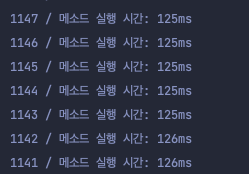
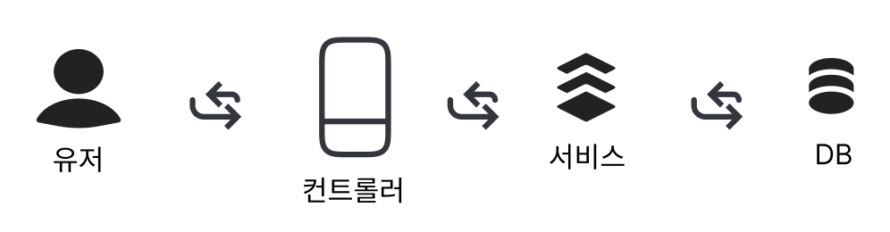
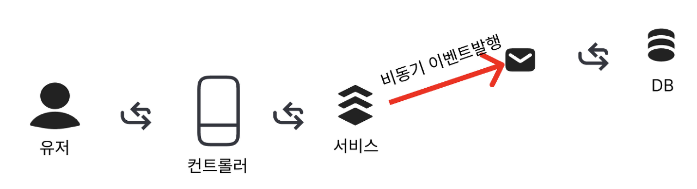
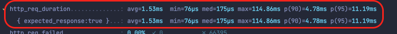
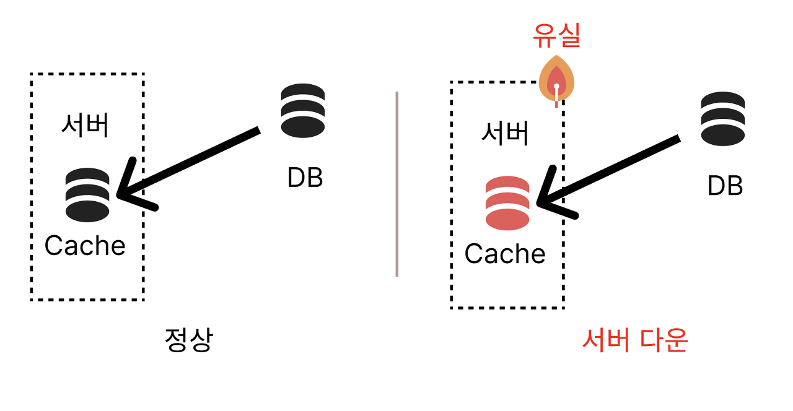
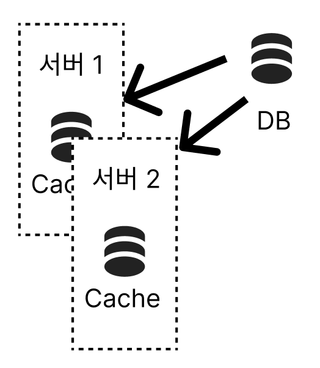
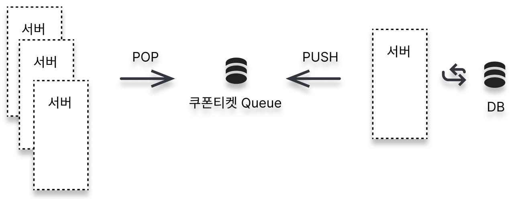

## 새로운 요구사항

> 팀장: 잘 구현 해주셨군요. 대략적인 쿠폰 발행에 대해 이해도가 높아진것 같네요. 서버로 이제 구현해주세요.

## 세팅하기

```gradle
# build.gradle
...

dependencies {
    implementation 'org.springframework.boot:spring-boot-starter'
    implementation 'org.springframework.boot:spring-boot-starter-data-jpa'
    implementation 'org.springframework.boot:spring-boot-starter-web'
    implementation 'com.google.guava:guava:30.1-jre'

    implementation 'com.mysql:mysql-connector-j'

    testImplementation 'com.h2database:h2'
    testImplementation 'org.springframework.boot:spring-boot-starter-test'
}

...

---

# Application

@SpringBootApplication
public class DemoApplication {

    public static void main(String[] args) {
        SpringApplication.run(DemoApplication.class, args);
    }

}
```

## 발급 서비스

```java
@Component
public class CouponTicketDistribution {
    private final static int COUNT = 2000;
    private final Map<Long, LinkedBlockingQueue<CouponTicket>> tickets;
    private final CouponRepository couponRepository;

    public CouponTicketDistribution(CouponRepository couponRepository) {
        this.tickets = new HashMap<>();
        this.couponRepository = couponRepository;
    }


    public synchronized CouponTicket publish(Long couponId) {
        LinkedBlockingQueue<CouponTicket> queue = getCouponTickets(couponId);

        if (queue.isEmpty()) {
            try {
                List<CouponTicket> couponTickets = getTickets(couponId);
                couponTickets.forEach(queue::offer);
            } catch (IllegalArgumentException e) {
                return null;
            }
        }

        return queue.poll();
    }

    public List<CouponTicket> getTickets(Long couponId) {
        Coupon coupon = couponRepository.findById(couponId).get();
        List<CouponTicket> couponTickets = coupon.publish(COUNT);

        couponRepository.saveAndFlush(coupon);
        return couponTickets;
    }

    private LinkedBlockingQueue<CouponTicket> getCouponTickets(Long couponId) {
        LinkedBlockingQueue<CouponTicket> queue = tickets.get(couponId);
        if (queue == null) {
            queue = new LinkedBlockingQueue<>();
            tickets.put(couponId, queue);
        }

        return queue;
    }
}
```

## 동시 요청 테스트

```java
@SpringBootTest
@ActiveProfiles("test")
public class CouponTicketDistributionTest {
    @Autowired
    private CouponRepository couponRepository;

    @Autowired
    CouponTicketDistribution couponTicketDistribution;

    @Test
    void traffic() throws InterruptedException {
        final int LIMIT = 1000;
        Coupon coupon = couponRepository.save(Coupon.limitOf(LIMIT));

        int numberOfThreads = (int) (LIMIT * 1.5);
        ExecutorService executorService = Executors.newFixedThreadPool(numberOfThreads);
        CountDownLatch latch = new CountDownLatch(numberOfThreads);

        AtomicInteger activeCount = new AtomicInteger();
        AtomicInteger errorCount = new AtomicInteger();
        List<Long> times = new ArrayList<>();
        for (int i = 0; i < numberOfThreads; i++) {
            int finalI = i;
            executorService.execute(() -> {
                try {
                    long startTime = System.currentTimeMillis();
                    long stackTime = 0;

                    CouponTicket actual = couponTicketDistribution.publish(coupon.getId());
                    if (actual == null) {
                        errorCount.getAndIncrement();
                    } else {
                        activeCount.getAndIncrement();
                    }

                    times.add(timeLog(finalI, startTime, stackTime));
                } catch (Exception e) {
                    System.out.println("발급불가 : " + finalI + " / " + e.getMessage());
                }
                latch.countDown();
            });
        }

        latch.await();

        assertAll(
                () -> assertThat(activeCount.get()).isEqualTo(LIMIT),
                () -> assertThat(errorCount.get()).isEqualTo(numberOfThreads - LIMIT)
        );
    }
```



오래걸리는 작업은 `126ms` 까지 나왔다.  
좀 더 빨리 할 수 없을까? 고민이 되었다.

_이미 발급이 종료되었다면 빠르게 리턴하면 좋지 않을까?_

```java
    public synchronized CouponTicket publish(Long couponId) {
        if (isFinal) {
            return null; <== 빠르게 리턴
        }

        ...
   }

    public List<CouponTicket> getTickets(Long couponId) {
        Coupon coupon = couponRepository.findById(couponId).get();
        updateIsFinal(coupon); # <== 추가
        List<CouponTicket> couponTickets = coupon.publish(COUNT);

        couponRepository.saveAndFlush(coupon);
        return couponTickets;
    }
```

**테스트 결과 `58ms`로 절반 정도 시간이 단축되었다.**

## 중간점검

-   쿠폰이 발급해야되는 양만큼 정확히 발급 테스트 완료
-   100ms 이하 처리 속도 테스트 완료

## 서버 부하 테스트를 위한 준비

### 컨트롤러

```java
@RestController
public class CouponController {

    private final CouponTicketDistribution couponTicketDistribution;

    public CouponController(CouponTicketDistribution couponTicketDistribution) {
        this.couponTicketDistribution = couponTicketDistribution;
    }

    @GetMapping("api/index")
    public ResponseEntity<TicketDto> index() {
        CouponTicket couponTicket = couponTicketDistribution.publish(1L);
        if (couponTicket != null) {
            return ResponseEntity.ok().body(TicketDto.of(couponTicket.getCouponId()));
        }

        return ResponseEntity.ok().body(TicketDto.fail());
    }
}
```

CouponTicket 또한 발급하고 데이터 베이스에 저장 코드를 추가하였다.

```java
# CouponTicketDistribution

...

public synchronized CouponTicket publish(Long couponId) {

       ...

        CouponTicket couponTicket = queue.poll();
        if (couponTicket != null) {
            couponTicketRepository.save(couponTicket); <== 쿠폰티켓 DB저장 
        }

        ...
}

...
```

## 부하 테스트

API 부하 테스트를 진행하고자 한다.  
부하 테스트는 응답시간만 간단하게 체크 할 것이기 떄문에, K6 부하 테스트를 활용한다.  
[k6.io](https://k6.io/)

### K6 테스트 스크립트

```javascript
# script.js
import http from 'k6/http';
import {check, sleep} from 'k6';


export const options = {
    stages: [
        {duration: "10s", target: 500},
        {duration: "10s", target: 3000},
        {duration: "10s", target: 3000},
        {duration: "10s", target: 0},
    ],
    thresholds: {
        http_req_duration: ['p(99)<100'],
    },
};

export default function () {
    const res = http.get('http://localhost:8080/api/index');
    check(res, {'status was 200': (r) => r.status === 200});
    check(res, {'error': (r) => JSON.parse(res.body).error === null});
    sleep(1);
}
```

_높은 트래픽에서의 속도만 측정할것이기 때문에 시간은 길게하지 않았다._


**응답시간이 만족스럽지 않다.**

_어디에서 지연이 되는걸까?_

아무래도 "CouponTicket"을 DB에 저장하는 비용이 가장 커보인다.

> couponTicketRepository.save(couponTicket); <== 쿠폰티켓 DB저장  
> 제거하고 다시 테스트 해본다.   


**결과**
> avg=4.5ms min=80µs med=1.11ms max=121.67ms p(90)=12.68ms p(95)=18.76ms

응답이 빨라졌다. 예상대로 DB저장할때 부하가 많이 발생하는것으로 확인했다.

### 부하로직을 비동기 처리로

굳이 DB 저장까지 동기적으로 처리 할 필요가 있을까?  
부하가 걸리는 작업은 비동기로 분리하면 어떨까?

**As-IS**



**To-Be**



-   이벤트

```java
public class RegisteredCouponTicketEvent {
    private final CouponTicket couponTicket;

    public RegisteredCouponTicketEvent(CouponTicket couponTicket) {
        this.couponTicket = couponTicket;
    }

    public CouponTicket getTicket() {
        return couponTicket;
    }
}
```

-   핸들러

```java
@Component
public class CouponTicketHandler {
    private final CouponTicketRepository couponTicketRepository;

    public CouponTicketHandler(CouponTicketRepository couponTicketRepository) {
        this.couponTicketRepository = couponTicketRepository;
    }

    @Async
    @EventListener
    public void save(RegisteredCouponTicketEvent event) {
        couponTicketRepository.save(event.getTicket());
    }

}
```

-   CouponTicketDistribution 수정

```java
@Component
public class CouponTicketDistribution {
  private final ApplicationEventPublisher applicationEventPublisher; <== 추가

  ...

  public synchronized CouponTicket publish(Long couponId) {

  ...
     CouponTicket couponTicket = queue.poll();
     applicationEventPublisher.publishEvent(new RegisteredCouponTicketEvent(couponTicket));

     return queue.poll();

}
```

다시 테스트 진행

**결과**



비동기로 처리하여 속도가 향상되었다. 하지만 문제점들이 보였다.

## 현재 문제점

⚡️로컬 캐쉬 이슈⚡️

**1\. 서버가 다운되면 로컬캐쉬가 모두 증발하기 때문에 데이터 불일치가 발생한다.**



**2\. 안정된 서비스 운영을 위해 서버 이중화가 필요한데, 현재 구조로는 서버 하나일 경우만 데이터 무결성,정합성이 유지된다.**

-   현재 구조에서 서버를 늘릴경우  


쿠폰티켓은 발행 제한을 시켜야한다.  
서버만 증설한다면 각자 캐쉬를 가지고 있기 때문에 정합성을 지킬 수 없다.  
서버간의 존재를 중재해줄수 있는 역할이 필요하거나 **글로벌 캐쉬 서버**가 필요 할 것 같다.

**3\. CouponTicket 생성 이벤트가 실패한다면?**

-   후속 처리가 필요하다. 유저는 이미 발급 성공을 받았는데 쿠폰 티켓이 존재하지 않는다면 서비스의 신뢰도가 하락 될 것이다.

### 단순화 하자

1.  쿠폰 발행 입장
    -   쿠폰을 발행만 한다.
2.  쿠폰전달 입장
    -   쿠폰이 있으면 전달만한다.



### 설명

1.  서버의 입장에서는 쿠폰이 있으면 Queue 저장소에서 빼서 전달만하면 된다.
2.  발급 서버는 쿠폰을 발급 하기만 하면 된다.

## 다음 포스팅에서는...

글로벌 캐쉬로 레디스를 사용해봐야겠다.


```toc

```