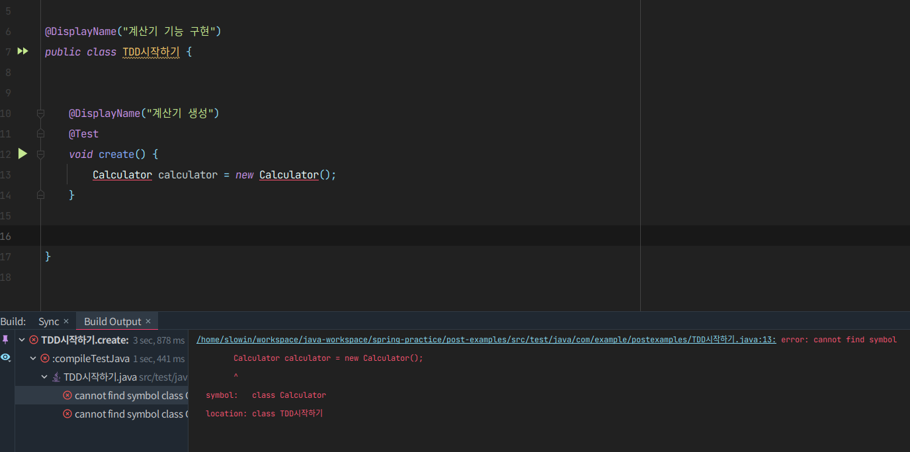
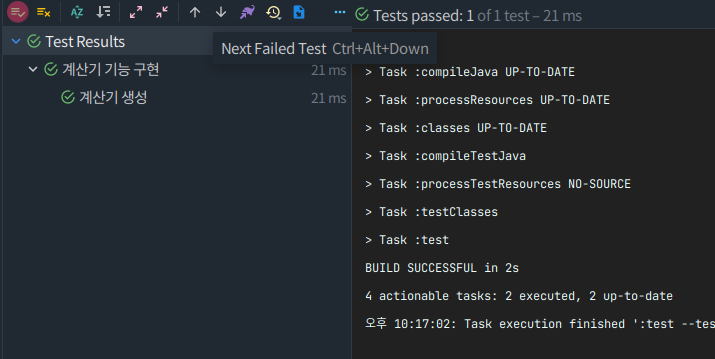

# TDD 란?

TDD 란 Test Driven Development 의 약자로 "테스트 주도 개발"이라고 합니다.

## TDD 의 장점
[출처](https://www.simform.com/blog/what-is-tdd/#benefits)
1. 코드 품질
   1. TDD 는 개발자가 단순한 설계를 할 수 있도록 도와줍니다. 일반적으로 OOP 구조를 유지할 수 있습니다. 
2. 애플리케이션 품질
   1. TDD 는 프로덕션 코드를 구현하기 전에 먼저 테스트를 해보고 프로덕션 코드를 구현 할 수 있습니다. TDD 를 통해 프로덕션 코드를 점진적으로 개발해 나가므로써, 철저한 테스트와 적은 버그를 발생 시킬 수 있습니다.
3. 생산성 향상
   1. 디버깅 시간을 줄일 수 있습니다. TDD 로 개발을 시작하면 초기에는 시간이 많이 소요 될 수 있습니다. 하지만, 새로운 기능 추가 및 테스트 시간이 더 빨라지고 든든한 테스트가 있기때문에 리팩토링에 부담을 줄일 수 있습니다.
4. 문서
   1. 테스트 코드는 문서 역할을 할 수 있습니다. 잘 정리된 테스트코드 가 있다면, 테스트 코드로 프로젝트를 이해 할 수 있습니다. 뿐만 아니라 모든 코드를 이해 하고 있지 않더라도 모든 개발자가 코드를 변경 할 수 있습니다.


## TDD 의 한계
[출처](https://www.simform.com/blog/what-is-tdd/#benefits)


>프로젝트의 범위가 커짐에 따라 단위 테스트를 유지 관리하기 어려워질 수 있습니다. 구현을 리팩토링하는 경우 테스트 이름도 바꿔야 합니다. 그리고 그들이 실제로 테스트하는 것에 대해 많이 말하지 않기 때문에 완료하기 전에 작성해야 하는 다른 테스트(있는 경우)가 무엇인지 알기가 어렵습니다.


## 테스트 주도 개발 단계

- 1단계 테스트 생성 및 실패 만들기
- 2단계: 필요한 모든 수단을 사용하여 테스트 통과
- 3단계: 리팩터링

### 예제로 살펴보기

- 시나리오
  - 두개의 숫자를 받아 더하기 기능 구현

위 기능을 구현하는 것을 TDD  1단계,2단계,3단계 방식으로 진행해 보겠습니다.

**- `Calculator` 클래스 만들기**

**1단계 실패하라**


`Calculator calculator = new Calculator();` 아직 `Calculator` 클래스가 없기때문에 당연히 실패합니다. 물론 이상할 수도 있지만, TDD 는 하나씩 쌓아가는 매력이 있습니다.  `Calculator` 를 만들어보겠습니다.

**2단계 필요한 모든 수단을 사용하여 테스트 통과**

```java
class Calculator {
}
```



**- 두개의 숫자를 받아 더하기 기능 구현**

**1단계 실패하라**

```java 
class Calculator {

    public int plus(int i, int i1) {
        return 0;
    }
}

# 테스트 코드
@DisplayName("두개의 숫자를 받아 더하기 기능")
@Test
void add() {
    // given
    Calculator calculator = new Calculator();

    // when
    int actual = calculator.plus(10, 20);

    // then
    assertThat(actual).isEqualTo(30);
}
```

`add()` 테스트 코드는 30을 리턴받기를 예상했지만 `plus` 메소드는 별다른것 없이 0을 리턴하므로 당연히 실패합니다.`plus` 함수를 만드는 것만으로 충분한 의미가 있습니다.(**실패하라**)

**2단계 필요한 모든 수단을 사용하여 테스트 통과**

```java
class Calculator {
    public int plus(int i, int i1) {
        return 30;
    }
}
```

`Calculator` 테스트를 통과 시키기 위해 30을 리턴시켜서 성공 시킬수 있습니다. 극단적인 방법을 써서 우선 성공하는지 `초록불`을 확인 하는 것도 하나의 TDD 과정중에 하나 일 수 있습니다;; ㅎㅎ  

이번에는 `plus` 메소드에 로직을 추가 해봅니다.

```java
class Calculator {

    public int plus(int i, int i1) {
        return i + i1;
    }
}
```


**3단계: 리팩터링**

변수이름을 좀더 의미 있게 변경하겠습니다.  
그리고 테스트 코드를 돌려봅니다.

```java 
public int plus(int number1, int number2) {
    return number1 + number2;
}
```
테스트 코드가 초록불로 성공이 되었다면 기능 구현은 생각대로 되었다고 볼 수 있습니다. 

정말 간단하고 극단적인 예시로 짧게나마 TDD 를 알아보았습니다.  
TDD 를 하며 느낀점은, 
1. 짧게 짧게 테스트 코드를 실행하면서 현재 개발 진행 단계를 빠르게 알 수 있다.  
2. 버그를 고치고 즉시 확인하며 어디가 문제인지 디버깅 하기 쉽다.
3. 기능별로 테스트 코드에 초록불이 뜨면 마음에 편암함이 느껴져서 코드에 자신감이 생긴다.
4. 리팩토링시 테스트 코드를 믿고 코드를 개선하기에 좋다.
등등....


-----
-----
> 처음에는 어렵겠지만 하다보면 분명히 많은 장점이 있는것 같습니다.  
> TDD 는 훈련이 중요하다고 생각합니다!