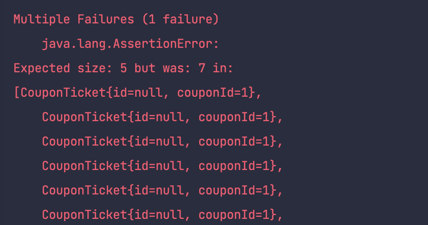
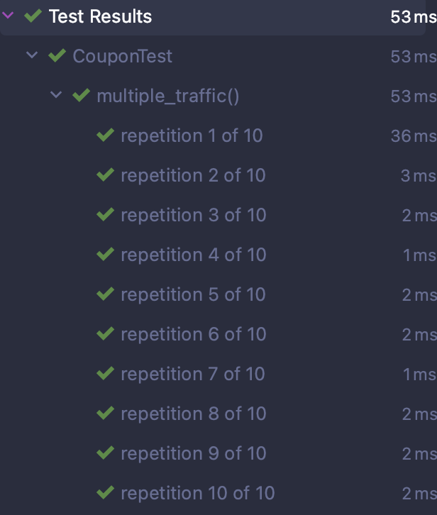
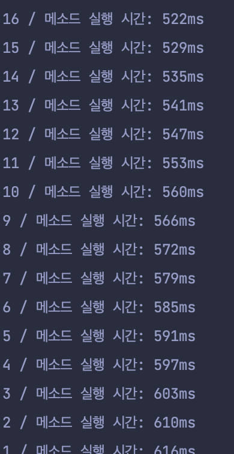
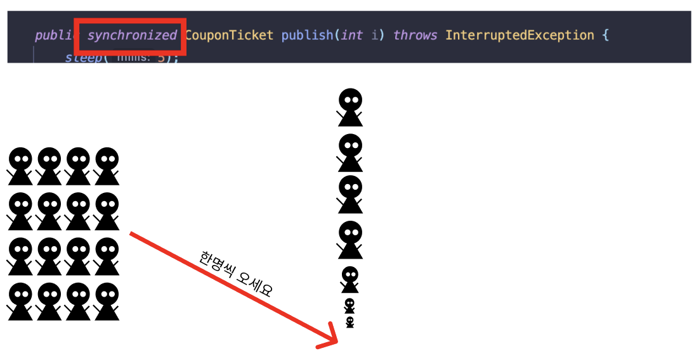
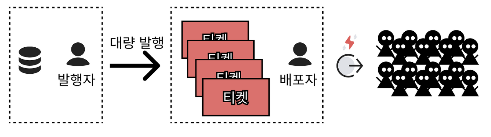
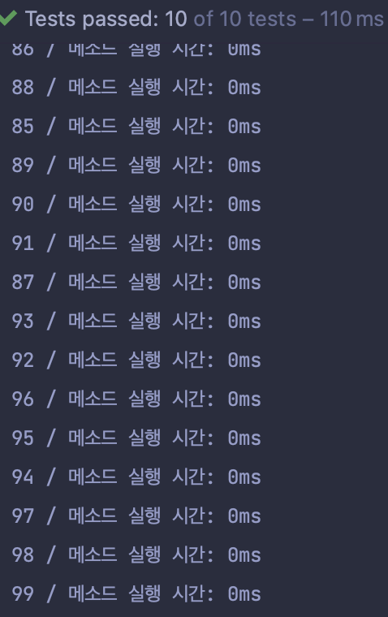

평화로운 어느날... 팀장이 신입을 불렀다.

> 팀장 : 다음주에 99% 할인 쿠폰 발행 행사를 하려고하는데, 다음주 까지 개발해주세요.  
> 요구사항은 다음과 같습니다.

1.  쿠폰은 최대 발행 갯수를 가지고 있습니다.
2.  쿠폰은 발행 갯수 만큼 발급 할 수 있습니다.
3.  쿠폰 발행 갯수 보다 쿠폰티켓을 초과 발급 할 수 없습니다.
4.  대규모 트래픽에서도 쿠폰 발행 갯수를 초과해서는 안된다.
5.  응답시간은 요청당 100ms이하로 한다.

요구사항을 던져놓고 팀장은 가버렸습니다...  
신입은 어떻게 해야할지 계획을 세워봅니다.

우선 요구사항 문서화하고 생각을 정리해봐야겠다고 생각합니다.

## 요구사항 정의

1\. 용어사전

영문한글설명

| User | 유저 | 가입한 유저 |
| --- | --- | --- |
| Coupon | 쿠폰 | 쿠폰 기본 정보 |
| CouponTicket | 쿠폰 티켓 | 발행 된 쿠폰 |

2\. 요구사항

-   쿠폰
    -   최대 발행 갯수를 가진다.
    -   쿠폰티켓 발행된 갯수를 가진다.
    -   최대 발행 갯수 만큼 쿠폰 티켓을 발행 할 수 있다.
    -   쿠폰티켓 발행 갯수는 최대 발행 갯수를 초과 할 수 없다.
-   쿠폰 티켓
    -   발행한 쿠폰이 존재해야한다.
    -   쿠폰 티켓을 소유한 유저ID 를 가지고 있다.

3\. 시스템 요구사항

-   대규모 트래픽에서도 쿠폰 발행 갯수를 초과해서는 안된다.

## 도메인을 파악해보자

```java
public class CouponTest {

    @Test
    void 쿠폰_발행() {
       Coupon coupon = new Coupon(1L, 10, 0);

       CouponTicket couponTicket = coupon.publish();

       assertNotNull(couponTicket);
    }
}

public class Coupon {

    private final long id;
    private final int publishLimit;
    private int published;

    public Coupon(long id, int publishLimit, int published) {
        this.id = id;
        this.publishLimit = publishLimit;
        this.published = published;
    }

    public CouponTicket publish() {
        if(publishLimit <= published) {
            throw new IllegalArgumentException("이미 모두 발행되었습니다.");
        }

        published++;

        return new CouponTicket(id);
    }
}

public class CouponTicket {
    private final Long id;
    private final long couponId;

    public CouponTicket(Long id, long couponId) {
        this.id = id;
        this.couponId = couponId;
    }

    public CouponTicket(long couponId) {
        this(null, couponId);
    }
}
```

"쿠폰_발행" , "쿠폰\_초과발행\_불가" 테스트를 통해 요구사항을 구현해보았다.  
시스템이 \_"대규모 트래픽에서도 쿠폰 발행 갯수를 초과해서는 안된다."_ 의 요구사항을 만족시키는지 좀 더 테스트를 진행해보아야 할 것 같다.  

## 동시요청에도 안전할까?

### 시나리오

-   동시 요청시에도 최대 발행 갯수 조건이 지켜질것인가?

```java
 @Test
    void multiple_traffic() throws InterruptedException {
        final int LIMIT = 5;
        final Coupon COUPON = new Coupon(1L, LIMIT, 0);
        int numberOfThreads = 10;
        ExecutorService executorService = Executors.newFixedThreadPool(numberOfThreads);
        CountDownLatch latch = new CountDownLatch(numberOfThreads);
        List<CouponTicket> couponTickets = new ArrayList<>();
        for (int i = 0; i < numberOfThreads; i++) {
            executorService.execute(() -> {
                try {
                    CouponTicket couponTicket = COUPON.publish();
                    couponTickets.add(couponTicket);
                } catch (Exception e) {
                    System.out.println("발급불가 : " + finalI + " / " + e.getMessage());
                }
                latch.countDown();
            });
        }
        latch.await();
        assertAll(() -> assertThat(couponTickets).hasSize(LIMIT), () -> assertThat(COUPON.isPublishAvailable()).isFalse());
    }
```



  
어느정도 예상했지만, 당연히 실패했다.  
멀티 Thread 환경에서 데이터 경합 문제가 발생될거라고 생각했기 때문이다.  
그렇다면 안전하게 처리하려면 어떻께 해야할까?

**중요한것은 요청을 하나씩 받고 한번의 요청을 다 처리하고 다음 요청을 받아드리는 것이다.**  
현재의 테스트 환경은 멀티 Thread 환경이기 때문에 thread-safe를 위해 `synchronized` 를 적용해 본다.

```java
    public synchronized CouponTicket publish(int i) {
        if(publishLimit <= published) {
            throw new IllegalArgumentException("이미 모두 발행되었습니다.");
        }

        published++;

        return new CouponTicket(id);
    }
```



반복적인 테스트에도 정상적으로 통과하는것을 확인 할 수 있었다.  

당당하게 팀장님에게 가서 동시요청 상황에서 안전하게 쿠폰발급 할 수 있도록 구현 완료했다고 보고했다.

> 팀장: 발급 갯수를 늘렸을때 100ms의 응답속도를 만족하나요?

  
다시 테스트 해본다. 로컬 환경이기 때문에 5ms 지연코드를 추가하여 테스트 해본다.

```java
    public synchronized CouponTicket publish(int i) throws InterruptedException {
        sleep(5); <== 지연추가
```

100개 발급으로 늘려서 테스트해보았다.



마지막 Thread의 완료 시간은 600ms가 나왔다.  
`synchronized` 추가하므로써 데이터 안정성은 지킬 수 있었지만, 속도 측면에서는 실패하고 말았다.

> _로우 리스크 로우 리턴이었다._

데이터의 정합성을 지키면서 빠른 속도 또한 원한다.  
그렇다면 무엇이 문제일까?



안전하게 하기위해 요청이 모두 완료 될때까지 이후 요청은 대기해야 했던것이 문제였다.  
발급하는 행위에 대해서는 안정성을 지켜야했기 때문이다.  

**행위는 무엇이 있을까?** 라는 생각을 했다.

## Task

-   쿠폰티켓 발급
-   쿠폰티켓 전달

두가지 행위로 분류해보았다.  
그렇다면, 한번에 발급을 해놓고 가져가기만 한다면 빨라지지 않을까?

As-Is


To-Be



### 간단하게 구현

우선 간단하게 구현해보기로 한다.  
`CouponService`를 만들고 생성될때 최대갯수 만큼 쿠폰티켓을 발급받고 `Queue`에 쌓아두었다.

```java
public class CouponService {
    private final Coupon coupon;
    private final LinkedBlockingQueue<CouponTicket> couponTickets = new LinkedBlockingQueue<>();

    public CouponService(Coupon coupon) {
        this.coupon = coupon;
        warmUp();
    }

    private void warmUp() {
        coupon.allPublish()
                .forEach(couponTickets::offer);
    }

    public CouponTicket publish() throws InterruptedException {
        return couponTickets.take();
    }
}

---

    # TEST
    @RepeatedTest(10)
    void multiple_traffic_speed() throws InterruptedException {
        final int LIMIT = 100;
        final Coupon COUPON = new Coupon(1L, LIMIT, 0);
        CouponService couponService = new CouponService(COUPON);

        int numberOfThreads = 100;
        ExecutorService executorService = Executors.newFixedThreadPool(numberOfThreads);
        CountDownLatch latch = new CountDownLatch(numberOfThreads);

        LinkedBlockingQueue<CouponTicket> couponTickets = new LinkedBlockingQueue<>();
        for (int i = 0; i < numberOfThreads; i++) {
            int finalI = i;
            executorService.execute(() -> {
                try {
                    long startTime = System.currentTimeMillis();
                    long stackTime = 0;

                    CouponTicket couponTicket = couponService.publish();
                    couponTickets.add(couponTicket);

                    timeLog(finalI, startTime, stackTime);
                } catch (Exception e) {
                    System.out.println("발급불가 : " + finalI + " / " + e.getMessage());
                }
                latch.countDown();
            });
        }

        latch.await();

        assertAll(
                () -> assertThat(couponTickets).hasSize(LIMIT),
                () -> assertThat(COUPON.isPublishAvailable()).isFalse()
        );
    }
```

**결과**



모두 다 동일한 시간으로 빠르게 처리 될 수 있다는것을 검증했다.  

정리해보자면,

1.  쿠폰발급: 쿠폰 발급에만 **집중**, 동시 여러개 발급 가능
2.  쿠폰전달: 쿠폰 전달에만 **집중**, 발급된 쿠폰이 있으면 즉시 전달

  
작업 내용을 팀장님에게 전달하였다.

> 팀장: 잘 구현 해주셨군요. 대략적인 쿠폰 발행에 대해 이해도가 높아진것 같네요. Spring boot로 이제 구현해주세요.

다음 포스팅에서 계속..


```toc

```